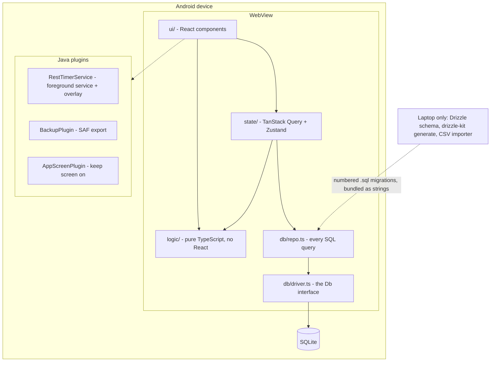

# loadout

An offline-first Android workout logger, built for one user and one
constraint: **logging a set must take about two taps.** Everything else is
negotiable.

It replaces a commercial app (Progression), importing five years of history:
6,206 sets across 343 sessions, 2021-07-06 to 2026-08-13. No server, no
account, no sync. The database lives on the phone and the app works in a
basement gym with no signal.

**Capacitor + React 19 + TypeScript 6 + Tailwind 4, over SQLite on device,
with three hand-written Java plugins for the parts the web platform cannot
reach.**

| | |
|---|---|
| TypeScript | ~17,500 lines across logic, data, state and UI |
| Java | ~1,050 lines: rest-timer service, overlay, backup, screen lock |
| Tests | 343, in 24 files, run in about 10 seconds |
| Migrations | 7, append-only, applied to a database with five years of rows in it |
| Engineering log | [`docs/PROJECT.md`](docs/PROJECT.md), 2,900 lines |

---

## What it does

Open the app, tap a workout, and start logging. The set you are about to
perform is already filled in from what you did last time, including the
progression cue if the last session earned an increase. A rest timer floats
over whatever else you are doing on the phone, turns red, and counts up past
zero. The plate chips tell you what to actually hang on the bar, and say so
plainly when your rack cannot reach the number.

Behind the logging loop: an exercise library with per-exercise history and
trend charts, a year-at-a-glance training calendar, weekly volume by muscle
group, session summaries that compare against the last time that workout was
done, and a stall detector that tells you when a lift has stopped moving.

## Architecture



Four rules hold the shape:

- **`logic/` is pure TypeScript with no React imports.** Progression rules,
  unit conversion, the plate solver, volume windows and date arithmetic are all
  ordinary functions over ordinary data, which is why 343 tests run in ten
  seconds with no test renderer.
- **Every SQL statement lives in `db/repo.ts`**, behind one `Db` interface with
  two implementations: `better-sqlite3` on the laptop and
  `@capacitor-community/sqlite` on the device. The same migration runner drives
  both.
- **No query inside a loop.** On device each call crosses the JS/native bridge.
- **TanStack Query owns historical reads; a plain store owns the live
  workout.** Query invalidation fits "log a set, the last-session view
  refreshes". A workout in progress is not a cached remote resource and was
  never modelled as one.

## Problems worth reading about

Each of these was measured, not assumed. The long version of every one is in
[`docs/PROJECT.md`](docs/PROJECT.md).

**The ORM cannot ship to the device, and finding out why took three separate
discoveries.** Drizzle generates the schema and the numbered migrations on the
laptop, and nothing more. Its migrator does `import fs from 'node:fs'`, which
cannot run in a WebView. No driver exists for the Capacitor SQLite plugin. And
the fallback, `sqlite-proxy`, reads result rows **positionally** while the
plugin returns them keyed by column name. Since every table here carries `id`,
`notes`, `created_at`, `updated_at` and `deleted_at`, a three-way join across
sets, sessions and exercises collapses the duplicate keys and silently
misaligns every later column. Plausible wrong numbers, no error. The device
runs plain SQL behind `query<T>(sql, params)` instead.

**A five-year import that reconciles exactly.** The importer round-trips 5,866
weights through lb to kg and back, and total volume matches between the source
CSV and the database at 7,543,590 lb. That number is the proof the conversion
is correct, and it exists because 9 of the 105 distinct weights in the export
fail a bit-exact round trip by about 3e-14. Invisible on screen, fatal for
`WHERE weight_kg = ?`. Weights are quantised onto a 0.1 g grid on write, and
compared through `weightsEqual` on read. `===` on a weight is a bug here, and
the rule is written down because it is not visible at the call site.

**Migrations are tested against a database with rows in it.** SQLite rebuilds a
table to add a constraint, and a rebuild that touches a parent needs
`foreign_keys = OFF` set *outside* the transaction: drizzle's own
`PRAGMA foreign_keys=OFF` is a no-op inside one, and `defer_foreign_keys` does
not help. An empty database cannot fail this way, so
`src/db/migrations.test.ts` migrates a populated one. Separately, every
`drizzle-kit generate` output is read before it is applied, because its
table-rebuild `INSERT ... SELECT` reads the newly added columns from the old
table every single time.

**The rest timer is a foreground service with a `SYSTEM_ALERT_WINDOW`
overlay,** hand-drawn in Java: a ring, an M:SS readout, a red count-up past
zero and a five-second haptic countdown. It hides itself while the app is in
front and survives the WebView being destroyed mid-rest, which is the case that
actually matters and the one that was actually tested on device.

**The plate solver is inventory-aware and refuses to lie.** The plates owned
here are 2.5, 5, 10, 25, 35 and 45 lb, with no 20, and a solver that only knew
denominations would cheerfully propose one. An unreachable target is shown as a
dashed chip with the shortfall, never rounded away. Its tests are a conformance
suite against chip rows measured off the reference app, rather than against an
idea of how a solver should behave.

**Everything is proved on the device, not in Node.** The repo layer, the
migrations with a backup taken first, the navigation stack against the Android
edge-swipe gesture, the export against a full uninstall, and the logging loop
against the real imported history. The Corrections section of the engineering
log records what that caught, including a transaction-nesting fault that had
never fired because no batch had ever run inside a transaction on device until
the first on-device seeder ran.

## Running it

```bash
npm install
npm run dev     # Vite dev server, seeds fabricated history into an empty database
npm run test    # vitest, 343 tests
npm run lint    # oxlint
npm run build   # tsc -b && vite build
```

To the phone:

```bash
npm run build && npx cap sync android
./android/gradlew -p android installDebug
```

The dev server seeds **fabricated** history, so the app is explorable without
the real data. See [`docs/PROJECT.md`](docs/PROJECT.md) for the device
workflow, the importer and the full command list.

## Data handling

This is a single-user app holding one person's training history, including free
text notes on sets.

- `Examples/` and `db/` are gitignored and hold the only copies of personal
  data. Nothing derived from them is committed or packaged as an Android asset.
- The device takes a `VACUUM INTO` backup before any migration runs, and
  exports to a synced folder, because app-private storage does not survive an
  uninstall. Both were proved on device, the second against an actual
  reinstall.
- `npm run import` refuses to run once any natively-logged set exists. Cutover
  is one-way, by design.

## Documentation

- [`docs/PROJECT.md`](docs/PROJECT.md) is the living engineering log: every
  decision, what was measured to support it, and a Corrections section
  recording what turned out to be wrong. Anything stated as fact there was
  measured; anything unverified says so.
- [`docs/PROGRESSION.md`](docs/PROGRESSION.md) records the reference app's
  behaviour, measured with `adb` rather than guessed at.
- [`CLAUDE.md`](CLAUDE.md) holds the working rules for this repository.
